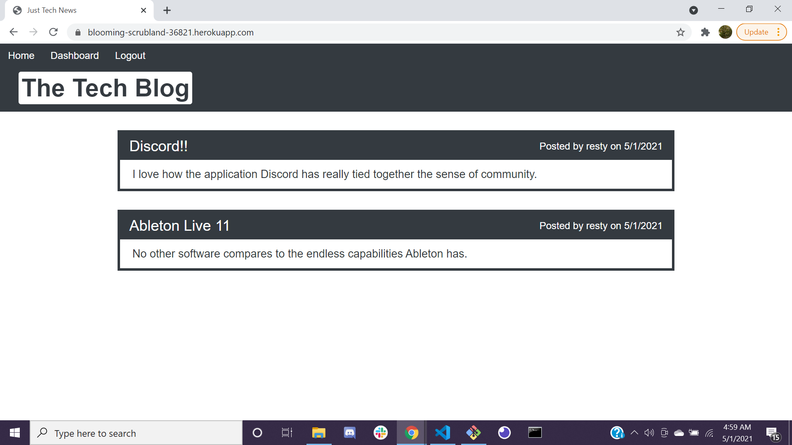

# Tech Blog

## Description 

A CMS-style blog site similar to a Wordpress site, where developers can publish their blog posts and comment on other developers’ posts as well.

## CSS Framework 

- Bootstrap

## Npm Packages

- bcrypt
- connect-session-sequelize
- dotenv
- express
- express-handlebars
- express-session
- mysql2
- sequelize

## Screenshot

## Credits

- Joshua Rendon
<http://github.com/jmrendon48> <jmrendon48@gmail.com>

### Link to Deployed Application

https://blooming-scrubland-36821.herokuapp.com/